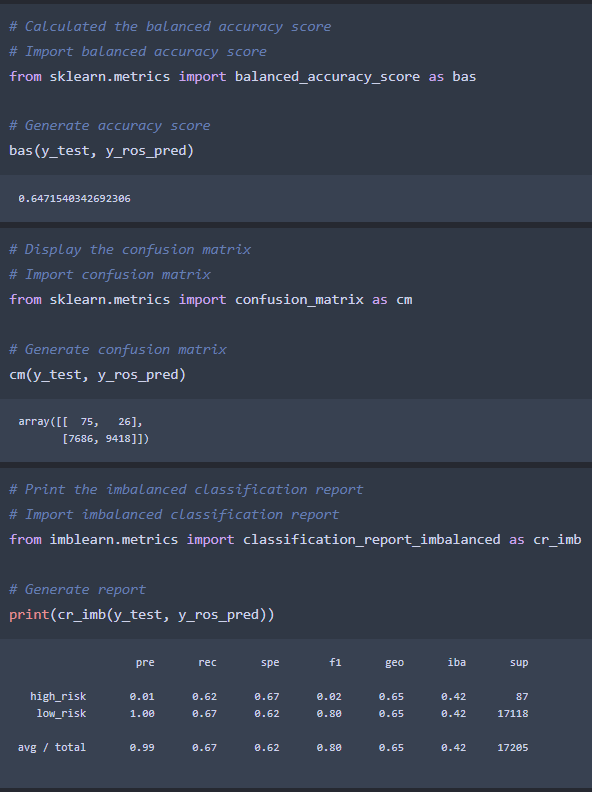
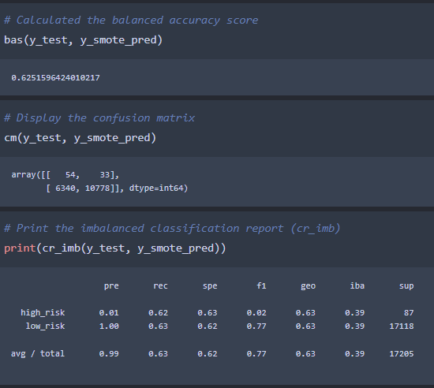
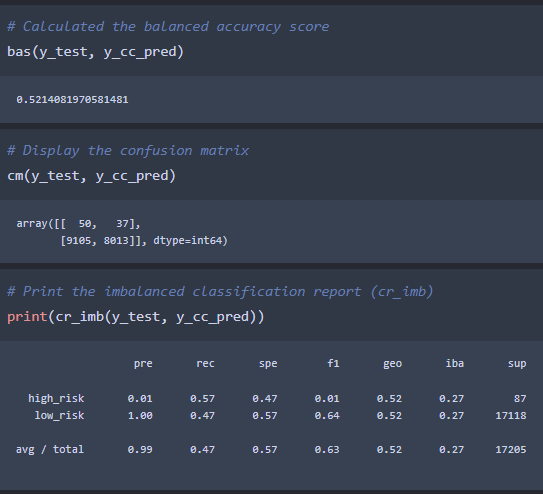
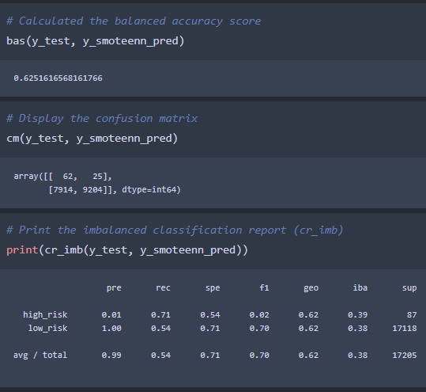
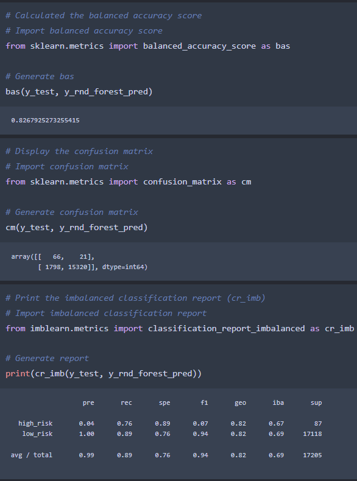
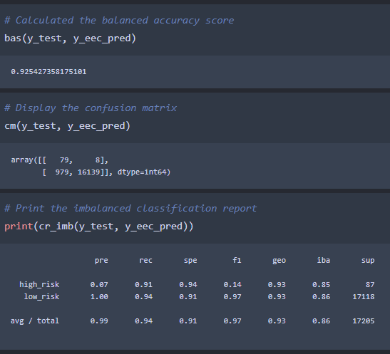

# **Credit_Risk_Analysis**

# **Resources**
*   **Data Source:** 
    *   LoanStats_2019Q1.csv (Unable to upload to GitHub due to file size, true source unknown)
*   **Software:**
    *   Anaconda 4.11.0
    *   Jupyter Notebook 6.4.5
    *   Python 3.9.7
    *   Visual Studio Code 1.63.2

# **Overview**
This challenge tasked me with creating and evaluating several machine learning (ML) models on a dataset pertaining to credit worthiness. The goal is to recommend, if any, a model for predicting high risk borrowers (HRBs) and low risk borrowers (LRBs).

The evaluated ML models include: 
*   **Over/Under Resampling**
    *   RandomOverSampler
    *   Synthetic Minority Oversampling Technique (SMOTE)
    *   ClusterCentroids
    *   SMOTEENN, A combination of SMOTE and Edited Nearest Neighbors
*   **Ensemble**
    *   BalancedRandomForestClassifier
    *   EasyEnsembleClassifier

Each ML method went through the same 4 steps: resample, fit/train, predict, results. The results include a number of statistical measures such as balanced accuracy, confusion matrices, and classification reports. These results were used to evaluate the methods against each other and come up with which model is best suited for the dataset.

# **Results**

## **RandomOverSampler**

## **SMOTE**

## **ClusterCentroids**

## **SMOTEENN**

## **BalancedRandomForestClassifier**

## **EasyEnsembleClassifier**

# **Summary**

When looking over the metrics of each ML model a few key things stand out. 

*   Every ML model used showed weak precision for detecting HRBs. 
*   The best performing method was the EasyEnsembleClassifier as evidenced by its accuracy score of **92.5%** and high sensitivity for HRBs at **91%**, meaning it detects nearly all HRBs in the dataset correctly.

Even with EasyEnsembleClassifier's great accuracy and high_risk sensitivity, I do not recommend it or any other model evaluated here at this time.

The reason for this is because it still contains a very low high_risk precision of **7%**. This means that there are many LRBs that are still being incorrectly flagged as HRBs. If you look at the EasyEnsembleClassifier confusion matrix, we can see that nearly 1000 LRBs were labeled as HRBs incorrectly. While this is better than HRBs being labeled as LRBs and subsequently given credit, because of this still very low precision further adjustments to the algorithm are needed.
